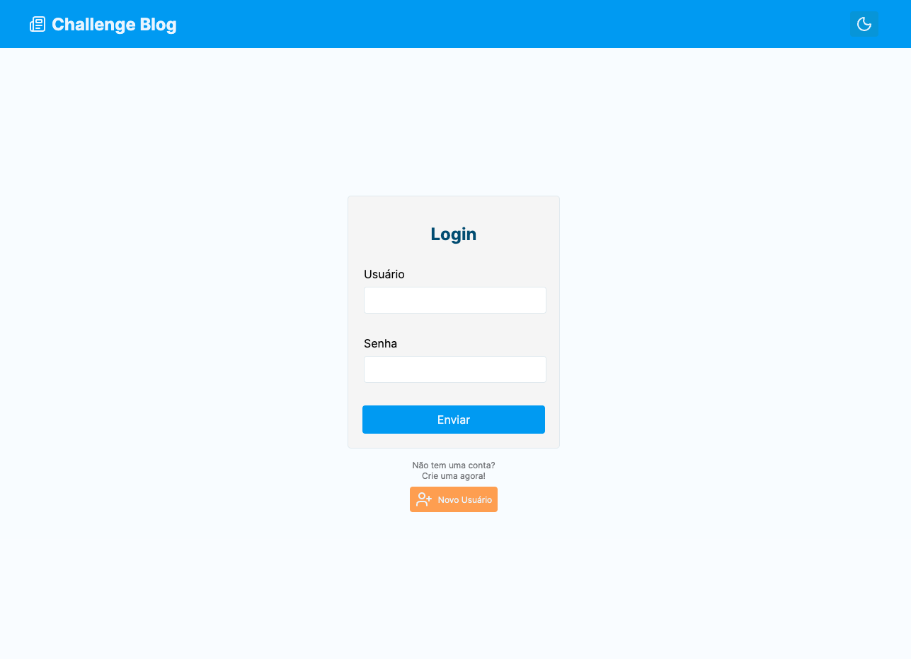
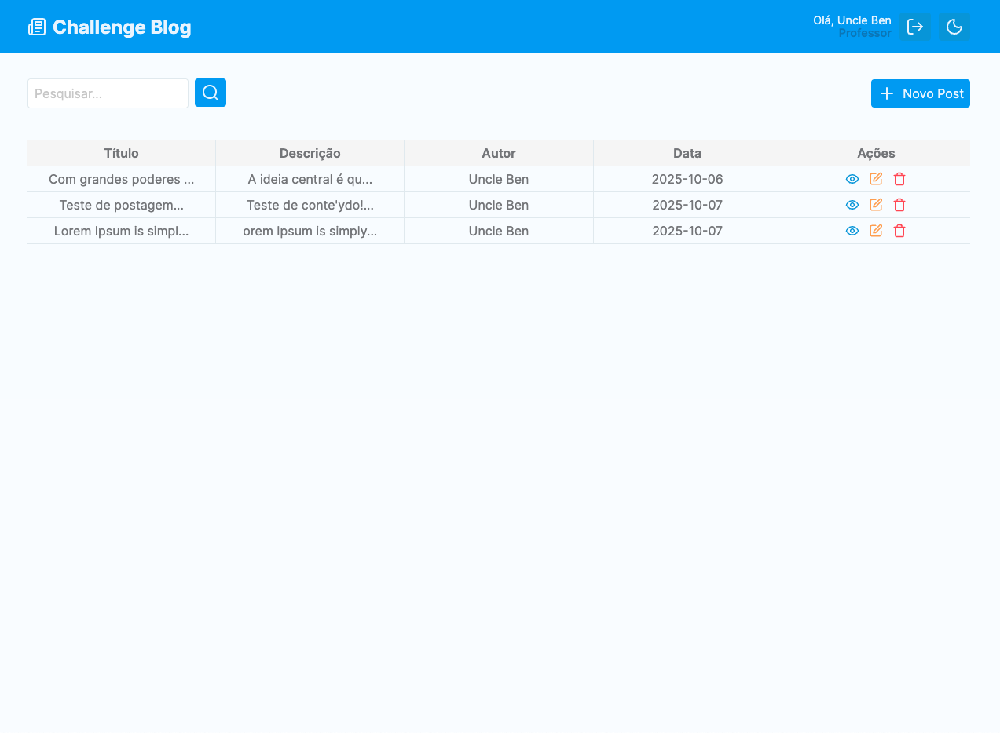

# Blog WEB - Tech Challenge

O **Blog WEB** é um serviço de front-end desenvolvido como parte do **Desafio Técnico da Pós-Graduação de Full Stack Development da FIAP Postech (5FSDT - Fase3)**. Seu principal objetivo é fornecer uma camada de front-end completa para uma aplicação de blog, lidando com a interface e a experiência do usuário.

O projeto foi construído com foco em boas práticas de desenvolvimento e modularizando os componentes, o que favorece a clareza, a organização e a facilidade de manutenção do código. A implementação foi realizada individualmente pelo aluno listado abaixo, com seu respectivo registro acadêmico.

`* Renato Carapiá Brunetti / RM362132`

  
  
  

# ⛭ Informações Técnicas

## → Containers

Os containers são unidades leves, portáteis e isoladas que empacotam uma aplicação junto com todas as suas dependências, garantindo que o software funcione de forma consistente em diferentes ambientes. Eles ajudam a evitar problemas de configuração e facilitam a implantação e escalabilidade da aplicação.

### + Docker

O Docker é a plataforma mais utilizada para a criação e gerenciamento de containers. Ele permite que os desenvolvedores definam ambientes completos de forma reproduzível, automatizando a construção, execução e distribuição de aplicações. No projeto, o Docker foi utilizado para containerizar a aplicação Node.js, promovendo padronização e facilidade no setup do ambiente.

 _"Docker Desktop executanto o serviço Web"_

Comando utilizado: `docker compose up -d web`

### + Docker Compose

O Docker Compose é uma ferramenta que permite orquestrar múltiplos containers de forma simples, por meio de um arquivo YAML. No projeto, ele foi utilizado para configurar e executar o serviço da aplicação, facilitando o desenvolvimento, testes e a manutenção do sistema como um todo.

## → Integração Contínua e Entrega/Implementação Contínua - CI/CD

CI/CD (Integração Contínua e Entrega/Implantação Contínua) é uma prática essencial em DevOps que automatiza os processos de teste, build e deploy de aplicações. Com CI/CD, o código passa por validações automatizadas sempre que há mudanças, garantindo maior qualidade, agilidade e segurança nas entregas.

### + GitHub Actions

O GitHub Actions é a ferramenta de automação do GitHub que permite configurar pipelines de CI/CD diretamente no repositório. No projeto, foi utilizado para automatizar testes, builds e o envio de imagens Docker para o DockerHub, garantindo que cada alteração no código seja validada e integrada ao fluxo de entrega de forma eficiente.

 _"GitHub Actions"_

### + Render

O Render é uma plataforma de cloud moderna que facilita o deploy de aplicações com pipelines automatizadas. No projeto, foi utilizado para publicar o serviço Web em ambiente de produção, com integração direto com o GitHub.

🔗 [Teste a aplicação em tempo real](https://fiap-postech-5fsdt-fase3-tech-challenge.onrender.com) _"Link temporário para avaliação"_

 _"Render"_

## → Tecnologias utilizadas

> Clique para visualizar a descrição de cada item

  
Node.js

  Um ambiente de execução JavaScript assíncrono e baseado em eventos. Ele permite a construção de aplicações de rede escaláveis e de alta performance, sendo a base para o desenvolvimento do back-end da API.

  
TypeScript

  Uma superset do JavaScript que adiciona tipagem estática opcional. Ele melhora a manutenibilidade, a legibilidade e a confiabilidade do código, detectando erros de forma antecipada e facilitando o desenvolvimento em equipe.

  
React.js

  Uma biblioteca declarativa e eficiente para a construção de interfaces de usuário (UI) baseadas em componentes reutilizáveis. Sua arquitetura fundamenta-se no conceito de Virtual DOM (VDOM), o que otimiza as atualizações de renderização e garante alta performance e manutenibilidade em Single Page Applications (SPAs) e aplicações que exigem gerenciamento de estado complexo.

  
Vite.js

  Uma ferramenta de build moderna (utilizando o bundler Rollup) e um servidor de desenvolvimento local ultrarrápido (baseado em ES Modules nativos). Ele otimiza o workflow de desenvolvimento através de Hot Module Replacement (HMR) extremamente veloz e builds de produção eficientes, eliminando o overhead de ferramentas de bundling legadas e melhorando significativamente a Developer Experience (DX).

  
Styled Components

  Uma biblioteca que implementa a metodologia CSS-in-JS, permitindo a escrita de estilos diretamente no JavaScript/TypeScript dos componentes. Isso garante que o estilo seja logicamente encapsulado junto ao componente (Scoping) e dinamicamente adaptável ao estado, melhorando a modularidade, prevenindo conflitos globais de CSS e facilitando a manutenção e o reaproveitamento do código.

  
Context API (React)

  Um mecanismo nativo do React para compartilhamento de estado que pode ser acessado por uma subárvore de componentes sem a necessidade de Prop Drilling. É uma solução arquitetural para o Gerenciamento de Estado Global ou Parcial, ideal para dados que são considerados "globais" para uma determinada funcionalidade, como temas, autenticação de usuário ou configurações de idioma.

  
react-router-dom

  Uma biblioteca de roteamento declarativo que permite o gerenciamento da navegação e das diferentes visualizações (páginas) dentro de uma Single Page Application (SPA). Ela utiliza o histórico do navegador para mapear URLs a componentes específicos, garantindo uma experiência de usuário fluida (sem recarregamento de página) e URLs persistentes que podem ser compartilhadas (Deep Linking).

  
Jest

  Um framework de testes em JavaScript, com foco em simplicidade. Ele é usado para escrever e executar testes unitários e de integração, garantindo que o código da aplicação funcione conforme o esperado e que novas funcionalidades não quebrem as existentes (testes de regressão).

  
GitHub Actions

  Uma ferramenta de integração e entrega contínua (CI/CD) do GitHub. Ela automatiza o fluxo de trabalho de desenvolvimento, como a execução de testes, a validação de código e o deploy da aplicação, garantindo um processo de entrega contínua e segura.

  
Docker

  Uma plataforma de contêinerização que permite empacotar a aplicação e suas dependências em um ambiente isolado. Isso garante que a API funcione de maneira consistente em qualquer ambiente, do desenvolvimento à produção, eliminando problemas de compatibilidade.

  
Docker Compose

  Uma ferramenta para definir e gerenciar aplicações multi-contêiner do Docker. Ela simplifica a orquestração do ambiente de desenvolvimento da API, permitindo que todos os serviços (como o Node.js e o PostgreSQL) sejam iniciados e conectados com um único comando.

  
ESLint

  Uma ferramenta de análise estática de código para identificar e reportar problemas no código JavaScript/TypeScript. Ela ajuda a manter um padrão de codificação consistente, evitar erros comuns e melhorar a qualidade geral do código.

  
Prettier

  Um formatador de código que garante que todo o código-fonte da aplicação seja formatado de forma consistente. Ele elimina discussões sobre estilos de código, promovendo um ambiente de desenvolvimento mais colaborativo e focado na lógica de negócio.

  
Axios

  Um cliente HTTP baseado em Promises que opera tanto em ambientes Node.js quanto em navegadores (browsers). Ele facilita a realização de requisições assíncronas (GET, POST, PUT, DELETE, etc.) ao backend, oferecendo recursos cruciais de engenharia como interceptores (para manipulação global de requisições e respostas), cancelamento de requisições e transformação automática de dados JSON, o que simplifica a camada de serviço/dados da aplicação.

## Rotas da API

- **Post**
  - `DELETE` Delete Post `/posts:id`
  - `GET` Find All Posts `/posts`
  - `GET` Find Post `/posts:id`
  - `POST` Create Post `/posts`
  - `PUT` Update Post `/posts:id`
- **User**
  - `POST` Create User `/users`
  - `GET` Find User `/user:id`
- **Role**
  - `GET` Find All Roles `/roles`
- **Auth**
  - `POST` Login `/login`

# ▶ Como executar o projeto

## → Executar em ambiente local de desenvolvimento

### + Requisitos

1. Instalar o Node.js

### + Execução

1. Adicionar um arquivo `.env` na raiz do projeto com todas as variáveis de ambiente cadastradas, e que podem ser encontradas no arquivo `.env.example`.
2. Executar o comando `npm i` ou `npm install` para instalar as dependências do projeto na pasta `node_modules` na raiz do projeto.
3. Executar o comando `npm run dev` para executar a aplicação.

# 🌐 Acessar o projeto em Produção

A aplicação está hospedada na plataforma Render e está temporariamente disponível para fins de avaliação. Por se tratar de um plano gratuito, a instância entra em modo de hibernação quando não está em uso, o que pode causar um tempo de carregamento inicial de até 30 segundos após períodos de inatividade.
Após esse carregamento inicial, os endpoints da API funcionam normalmente. Recomendamos aguardar esse tempo na primeira requisição e, se necessário, realizar novas chamadas após a ativação do serviço.

**API URL**: https://challenge-2wqh.onrender.com

**WEB URL**: https://fiap-postech-5fsdt-fase3-tech-challenge.onrender.com

# ⛬ Experiências e Desafios

O desenvolvimento desta aplicação Web de Blog foi um exercício robusto de engenharia de software, focado na integração de tecnologias state-of-the-art e na aplicação de padrões de desenvolvimento de alta maturidade. Isso exigiu um planejamento meticuloso e uma arquitetura de código bem definida.

## Arquitetura de Componentes e Gerenciamento de Estado

Um desafio central foi a gestão de complexidade de estado no React. Implementei uma estrutura modularizada e estrita utilizando hooks e types, separando responsabilidades claramente entre camadas (components, pages, hooks e types). Essa decisão arquitetural foi crucial para garantir a legibilidade, manutenibilidade e, primariamente, a escalabilidade do frontend, mitigando o risco de acúmulo de dívida técnica.

## Infraestrutura, Containerização e DevOps

A containerização completa da aplicação, incluindo a orquestração de rede entre os containers do frontend, API e banco de dados via Docker e Docker Compose, representou um marco significativo. O domínio sobre a definição de networks e volumes foi fundamental para estabelecer um ambiente de desenvolvimento e produção isomorfo e funcional.

A automação do workflow de entrega através do CI/CD foi outro pilar do projeto. Utilizei GitHub Actions para configurar pipelines que automatizam testes, build da imagem Docker e deploy para a plataforma Render. O tuning constante desses pipelines resultou em um fluxo de deployment confiável e de integração contínua (CI) que garante a rastreabilidade e a qualidade da entrega de código.

## Ganhos de Proficiência e Boas Práticas

O projeto consolidou a experiência prática em conceitos essenciais para o ciclo de vida do software:

- Qualidade de Código: Reforço das boas práticas com o uso de ESLint, Prettier e TypeScript para garantir coerência e segurança de tipos.
- Gerenciamento de Estado: Profundo entendimento e aplicação do Context API do React para gestão eficiente de estado global/parcial.
- Versionamento: Proficiência em Git Flow ou GitHub Flow para versionamento e colaboração assíncrona.
- Experiência do Usuário: Implementação de um design responsivo para garantir acessibilidade e usabilidade em diversas plataformas.

Em síntese, este projeto foi uma prova de conceito abrangente sobre como engenheirar e entregar uma solução full-stack moderna, partindo da definição arquitetural de componentes até a entrega contínua em ambiente de nuvem. O resultado final é uma aplicação robusta, performática e preparada para a sustentação em produção.
